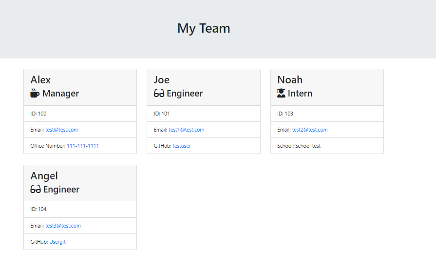

# TeamProfileGenerator

## User Story

SO THAT I have quick access to their emails and GitHub profiles

## Summary

This application uses node.js, fs, util and inquirer to create prompts for the user to fill out team members and their information.  At the end HTML file is generated that displays a nicely formatted team roster based on user input.  This application  includes `Employee`, `Manager`, `Engineer`, and `Intern` classes. Application uses [Jest](https://www.npmjs.com/package/jest) for running the unit tests and [Inquirer](https://www.npmjs.com/package/inquirer) for collecting input from the user.

## Installation:

You need to make sure node.js, util, fs, jest and inquirer instaled before you run the application.

## Usage

This application allows for a user to create a team roster.

## Project Demo

Below is the walkthrough video that demonstrates the functionality of the README generator. 

[![Readme video]](https://drive.google.com/file/d/1rS-xVxk8h7kgeb86bX4uPnZBhf5BCTkF/view)

## Ouput

### 

## Repository

https://github.com/KannaVairavan/TeamProfileGenerator.git

